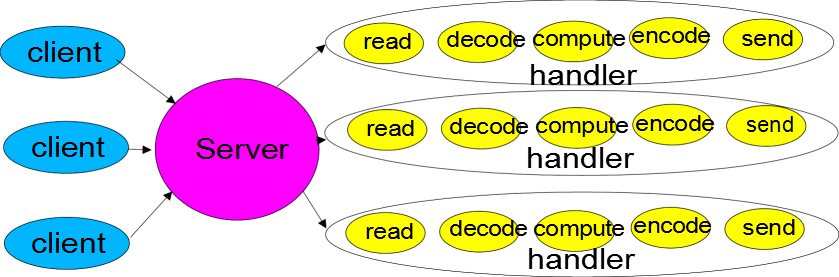
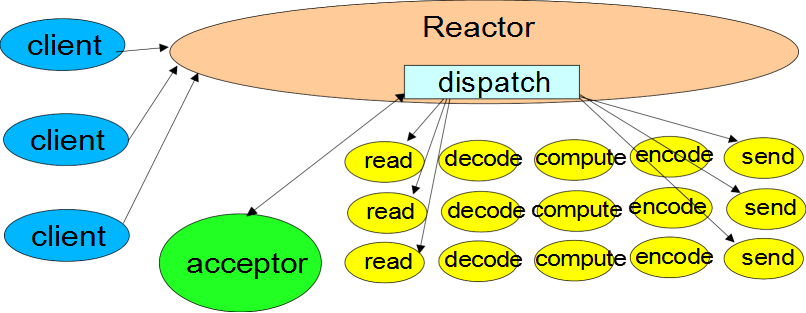

# 开撕Netty

> “不动笔墨不读书”的道理到哪都一样, 边学边练习同时记录下。
> 另外，课件地址：https://pan.baidu.com/s/1yMAtTG36W3ekVO_zqDnkew 提取码: his7 

- 跟着一个好的教程学一套比零零散散看书来的实惠。推荐下韩顺平老师的《[尚硅谷韩顺平Netty视频教程](https://www.bilibili.com/video/av76227904/)》

基本内容：
---
1. 认识网络IO  
使用telnet作为客户端的方式让人影响深刻  

2. BIO/NIO/AIO对比，应用场景分析  
    - BIO 连接数小 + 连接数固定
    - NIO 连接数多 + 连接短暂
    - AIO 连接数多 + 连接时间长  
  
3. NIO基本组件 Buffer/Channel/Selector  

4. 基于NIO的TCP通信的Server&Client

5. Reactor响应模式  
推荐了大师Doug Lea的《Scalable IO in Java》，所谓一图胜千言，来:   
    - 传统服务设计模式
 
    - Ractor单线程设计模式
 
   - Ractor多线程设计模式
 
   - Ractor主从多线程设计模式（netty）
 

6. 基于NIO的聊天室程序  

7. Netty
    - TCP连接的Server&Client

    - 实现HTTP服务端

    - 聊天室应用程序

    - 心跳检测

    - 基于websocket的全双工通信
    
    - InboundHandler与OutBoundHandler调用关系
    
    
    
    
